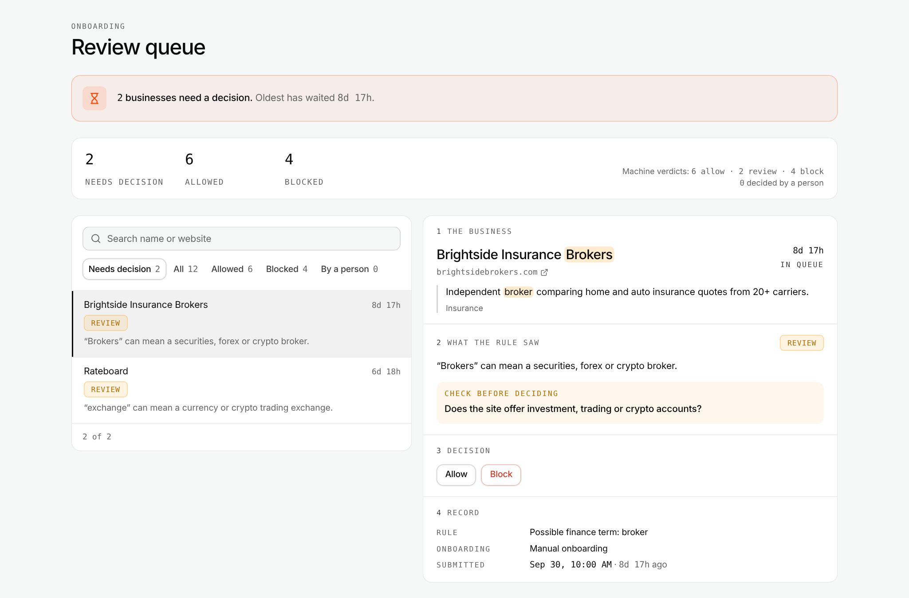
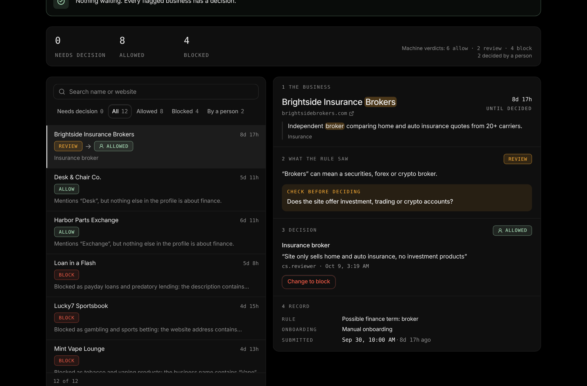
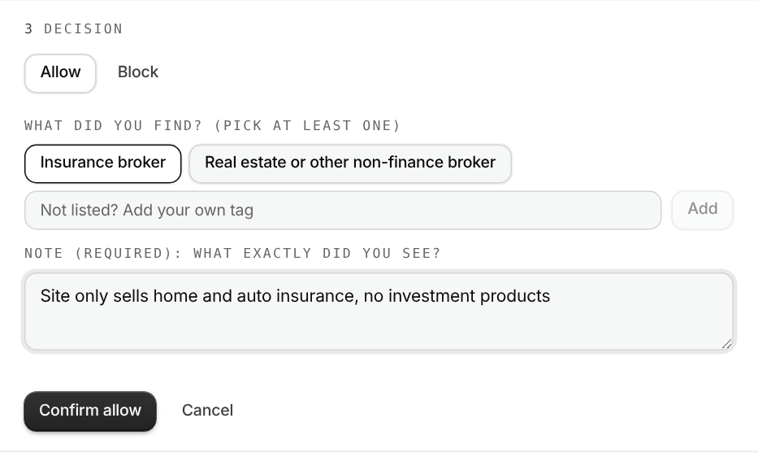
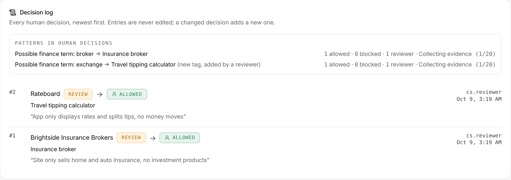

# Onboarding review queue: submission

**Sylvan Wang** · branch `sylvan/review-queue`

## Run it

```bash
npm install
npm run dev     # http://localhost:5173
npm test        # 40 tests, including the original 5
```

## What is delivered

| Task | Result |
| --- | --- |
| 1 · Readable queue | A split-view work queue for CS: list on the left, the oldest waiting business already open on the right. Plain language throughout, no raw codes. |
| 2 · Wrong verdicts | Two real errors and two noisy reviews fixed, plus one latent false block. 5 original tests untouched and passing; new tests lock in every fix. |
| 3 · Human in the loop | Allow / Block with required tags + note, machine and human verdicts side by side, append-only log, summary reflects outcomes, and a patterns view that turns decisions into rule candidates. |
| Found on the way | The design system's dark-zone tokens did not invert. Fixed in a separate commit (`a699b28`). |



---

## 0 · How I worked with the coding agent

I built this with Claude Code. The real session was iterative: a prototype, my review, research, revision, review again. Below is that process distilled into the repeatable steps I would follow next time, with the prompt I use at each step. My rule throughout: **the agent proposes, I decide, and nothing ships until I have checked it running.**

| Step | What I do | Prompt to the agent |
| --- | --- | --- |
| 1. Understand before building | Read the brief, the data and the rule. Name the user and their jobs before any UI. | *"Read README, `profiles.ts` and `moderation.ts`. Don't write code. Tell me who uses this screen, what jobs they come to do, and what in the data supports each job."* |
| 2. Baseline | Run it and record every current verdict, so every later change can be compared. | *"Run the rule on all 12 profiles and give me a table: business, verdict, reason code, evidence. Don't change anything."* |
| 3. One prototype, then review as the user | One direction, not options. I review it as a CS reviewer, not as a designer. | *"Build one version of the queue. Then list, for each element, which user job it serves. Anything that serves no job is a candidate for removal."* |
| 4. Ground choices in principles and constraints | Each layout decision gets a reason I can say out loud: a user job, a principle (chunking, Hick's law) or a constraint (volume). | *"Justify every block on this page as: what the reviewer is doing → so this shape → what I rejected and why. Assume the queue grows to thousands of businesses."* |
| 5. Change the rule test-first | Lock all 12 current verdicts in a test, keep the original tests untouched, then change the rule and read exactly what moved. | *"Add a test that pins the verdict of every fixture. Then fix X. Show me which fixtures changed and why. Do not edit the existing tests."* |
| 6. Audit with evidence | Check every brand rule with a search or a render, not by eye. | *"For each rule in the README's brand section, prove compliance with a grep or a screenshot, including inside `.zone-dark`. List violations with file and line."* |
| 7. Verify and ship | Typecheck, tests, build, click through the real flow, screenshot. Separate commits for separate concerns. | *"Run tsc, tests and build. Click through: decide one review with a preset tag and one with a new tag. Screenshot each state."* |

**Decisions that were mine, not the agent's:** mouse-only interaction (CS works with a mouse, so no keyboard shortcuts); designing for thousands of profiles from the start; no JSON-like values anywhere for CS; letting reviewers add their own tags; keeping Peak Trading Academy's verdict (an original test protects it); fixing the "bar" false block.

---

## 1 · Make the queue readable

### Who uses it, and for what

The CS team is not technical; for them the JSON dump is unreadable. They come to this page for two jobs:

1. **Decide** businesses the rule could not decide (`review`).
2. **Answer a customer** who asks why they were blocked. They need to find one business fast and explain the reason in words.

Every element on the page serves one of these jobs.

### Layout

| Block | The question it answers | Why this shape | What I rejected |
| --- | --- | --- | --- |
| Orange banner | Is there anything for me to do? | The only Spark Orange on the page: it is the only call to action. Names the oldest wait, because that is what breaches first. | A count inside the stats, where it weighs the same as "6 allowed". |
| Summary strip | What happened to these businesses? | Leads with outcomes (needs decision / allowed / blocked). Machine verdict counts sit in small print, because they are for judging the rule, not for doing the work. | Six equal numbers. |
| List (left) | Which business next? Where is this customer? | Defaults to *Needs decision*, oldest first. Search by name or website, because the trigger for job 2 is a name in an email. Loads 50 at a time and scrolls in its own panel. | One long page of cards: fine for 2 items, unusable for 2,000. |
| Detail pane (right) | Should this business be allowed? | Opens on load with the oldest waiting business, so the most important thing is visible before any click. After a decision it moves to the next business. | Expandable rows, which hide the evidence and the buttons behind a click. |

The detail pane is **chunked into four numbered sections, in the order a reviewer reasons**:
**1 The business** (who they say they are) → **2 What the rule saw** (verdict, why, what to check) → **3 Decision** → **4 Record**.

The *Decision* chunk follows Hick's law: two choices only (Allow / Block), with a highlighted "Check before deciding" question as the recommended path.

### Plain language, and where every word comes from

There is no AI in this product; the rule is deterministic. Every word on screen has one of three sources:

| On screen | Source |
| --- | --- |
| Business name, description, website | `src/data/profiles.ts`, shown verbatim |
| Verdict, matched word, category | The rule, `src/lib/moderation.ts` |
| "Why it's here", "Check before deciding", readable labels | `src/lib/explain.ts`: one fixed entry per reason code |

`explain.ts` is a dictionary, not a generator: `ambiguous_broker` always produces the same sentence. Labels are a fully typed map, so adding a reason code without a label fails the build. The raw reason code is still available to engineers as a hover tooltip on "Rule".

That copy is policy content, so in a real team the Google Ads policy owner should sign it off.

### StatusBadge

`StatusBadge` knows campaign states, not verdicts. The options:

- **Reuse it** (review → "pending", block → "rejected"). No new code, but an allowed business would carry `data-status="serving"`, a campaign state. A future change to how "serving" looks would silently change the review queue.
- **Extend it** with verdicts. One shared primitive serving two unrelated domains.
- **A sibling, `VerdictBadge`** (chosen). Same visual language and colour meaning, its own vocabulary. Costs a few duplicated style lines.

If a third badge domain appears, that is when I would extract a shared, tone-only base. Two uses do not justify the abstraction.

### Brand rules

Each rule was checked with a search or a render:

| Rule | Status |
| --- | --- |
| One accent | Spark Orange appears once: the banner. |
| No hardcoded hex; palette carries meaning | No hex anywhere. Mint = allowed and saved, amber = review and "check", danger = blocked. |
| Radii | Card / control / badge only. One one-off radius fixed. |
| Numbers, IDs, timestamps mono; labels mono uppercase | All numbers use `font-data`. All labels use the `Eyebrow` primitive. |
| Type roles | No one-off sizes. The badge's 11px is copied from `StatusBadge` itself. |
| Reads correctly inside `.zone-dark` | Failed at first, because of a token bug in the design system (below). Passes now. |
| Hairlines over shadows; content visible before animation | Borders only; no animation. |

**Finding: the dark-zone token bridge did not invert.** In `theme.css`, the shadcn aliases (`--card`, `--background`, `--foreground`…) were declared only on `:root`. A custom property that uses `var()` is resolved where it is declared, so inside `.zone-dark` they kept their light values while brand utilities like `text-cream` inverted. The result was light text on white cards, and it affects the library's own `Card` everywhere. The fix declares the same block on `.zone-dark` and `.dark` as well. It is in its own commit (`a699b28`), so it can be reviewed or reverted independently.



---

## 2 · The rule is wrong for some of these

### Original verdicts

| Business | Original | After | Why |
| --- | --- | --- | --- |
| **Stake House BBQ** | **block** (gambling) | allow | **Wrong.** `\bstake\b` blocks the English word. A steakhouse pun is not the Stake.com brand. |
| **Loan in a Flash** | **allow** | block (payday) | **Wrong.** It never says "payday"; it says "instant loans… no credit check… money within the hour". The rule matched labels, not the product. |
| Desk & Chair Co. | review | allow | Noise. "Desk" is only suspicious in finance; this is furniture. |
| Harbor Parts Exchange | review | allow | Noise. Boat parts, no money vocabulary. |
| Rateboard | review | review | Kept on purpose. "Currency exchange" is genuinely ambiguous. |
| Brightside Insurance Brokers | review | review | Kept on purpose. "Broker" in insurance vs. securities. |
| Peak Trading Academy | allow | allow | Kept. See below. |
| the other 5 | unchanged | unchanged | Correct. |

Original lines: [`moderation.ts#L128`](https://github.com/HaoranChen39/Sylvan-Wang-Oct5th-mp_interview/blob/main/src/lib/moderation.ts#L128) (stake), [`#L176`](https://github.com/HaoranChen39/Sylvan-Wang-Oct5th-mp_interview/blob/main/src/lib/moderation.ts#L176) (payday), [`#L194-L203`](https://github.com/HaoranChen39/Sylvan-Wang-Oct5th-mp_interview/blob/main/src/lib/moderation.ts#L194-L203) (ambiguous terms).

### Fixes

1. **"stake" only as a brand.** It is matched next to `.com` / `.us`, or next to casino, sportsbook or bets. The hostname `stake.com` is still blocked by the domain list.
2. **Payday lending by what the product is.** Block "instant / same-day / fast / emergency loans" and "no credit check" in the same sentence as "loan". A bare "loan" (a mortgage broker, say) goes to **review** under a new `ambiguous_lending` code, not to block.
3. **Ambiguous terms need finance context.** "desk", "exchange", "broker" or "trading" only escalate when the profile also talks about money (insurance, stocks, currency, crypto, loans…). Otherwise the result is `allow` with code `ambiguous_term_no_finance_context`, and the evidence records which word was ignored. A profile with no description stays in review, because there is nothing to judge.
4. **A bare "bar" is not alcohol.** This was a latent false block: protein bars, salad bars and bar exam prep. "bar" now needs a drinks word (cocktail, sports, whisky…) or "bar & grill"; "pub" stays blocked.

### Kept on purpose: Peak Trading Academy

It is allowed only because onboarding is `COMPLETE`. Original test 5, *"lets a verified user through on ambiguous terms"*, protects exactly this case, so the team chose it on purpose: a verified, paying business should not be stopped by a word. I kept it.

My view: finishing onboarding tells us *who* the business is, not *what it sells today*. If a verified business later rewrote its description to "forex trading", it would still pass. I would re-run the check whenever the description changes.

### Tests

- The 5 original tests are unchanged and pass.
- 12 new rule tests, including: the Stake brand is still blocked; a mortgage broker goes to review, not block; a currency app stays in review; a profile without a description stays in review; protein bars are allowed and cocktail bars are blocked.
- **One test pins all 12 verdicts.** Any future rule change shows its blast radius on the real fixtures.

### The trade-off

A wrong **block** costs a real customer who did nothing wrong and has no easy way to appeal, so blocks must be high precision: explicit evidence only. A wrong **review** costs a few minutes of CS time, so inside finance I would rather review too much than too little. Outside finance I stopped reviewing, because noisy reviews train people to click "allow" without reading.

The risk I accept: a bad actor who avoids every money word now passes the ambiguous check. The explicit patterns, the domain list and Google's own ad review still stand behind it.

---

## 3 · Put a human in the loop

### The requirements

| Requirement | Where |
| --- | --- |
| Resolve a `review` as allowed or blocked | Detail pane, chunk 3 |
| Short required note | Required, at least 5 characters |
| Machine verdict visible next to the human one | List: `REVIEW → 👤 ALLOWED`. Pane: chunk 2 (machine) and chunk 3 (person). Log: both on every entry. The person icon keeps a human "Allowed" from reading as the machine's "Allow". |
| Append-only log | `appendDecision` returns a new, frozen array; nothing is edited or removed. Changing a decision appends a new entry, and the latest wins. |
| Outcome in the summary | Needs decision / Allowed / Blocked update immediately, plus "N decided by a person". |



### Going one level deeper: decisions as data

A note alone can't be counted: "insurance only", "just insurance" and "home/auto quotes" mean the same thing but won't group. So each decision also records **what the reviewer found**, as tags:

- **Preset tags per reason code.** Each tag answers that code's "check" question. For `ambiguous_broker`: *Insurance broker* / *Real estate or other non-finance broker* (allow); *Securities or investment broker* / *Forex or crypto broker* (block).
- **Reviewer-added tags.** For a case nobody foresaw, the reviewer types a tag (say, "Protein bar") and adds it. It is normalised, so "  protein BAR " and "Protein bar" group together, and it is offered as a one-click option the next time the same kind of case comes up. A reviewer is never forced into a wrong tag.
- **Note.** Still required, for the specifics.

Every decision record therefore holds: business, machine verdict and reason code *as the reviewer saw them*, decision, tags, note, reviewer, time. Each field is there for a reason:

| Field | What it enables |
| --- | --- |
| Machine verdict snapshot | The history stays true after the rule changes. |
| Tags | Grouping → rule candidates (below); later, a labelled set to measure an LLM assistant against. |
| Reviewer | Agreement between people. One person's habit is not a rule. |
| First decision time | Time to decision. A later correction must not make the business look like it waited longer. |

### From decisions to rule candidates

The log shows **patterns in human decisions**: current decisions grouped by reason code and tag, each with a status.

- **Collecting evidence:** shows progress, e.g. 3/20.
- **Rule candidate:** 20+ decisions, all the same, by 2+ reviewers.
- **Reviewers disagree, keep human:** a split pattern is evidence that the case needs judgment.

Reviewer-added tags are flagged as new. A new tag that keeps coming back means the playbook is missing a category.



### Edge cases

| Case | Behaviour |
| --- | --- |
| Last item decided | Pane shows "Queue is clear"; banner turns mint. |
| Note of only spaces, or no tag | Confirm stays disabled, with a message. |
| Decision changed | New entry; latest counts in summary and patterns; time to decision stays at the first decision. |
| Rule changes after a decision | Human decision still wins; the log keeps the machine verdict the reviewer actually saw. |
| Allow / Block switched mid-form | Tags that no longer apply are dropped. |
| Search finds nothing | "No business matches '…'". |

**Known limits, deliberately out of scope:**

- **State is in memory** (allowed by the brief). In production: an insert-only table, so the database itself enforces append-only.
- **One reviewer, no login** ("cs.reviewer"). In production, two people deciding the same business at once needs a guard ("Already decided by Anna 2 minutes ago").
- **Machine blocks cannot be overridden here.** The brief scopes decisions to `review`. But a wrongly blocked customer will contact CS, so I would add **"Request override"**: an escalation to a lead, not a one-click button, because overturning a block is a policy decision and deserves a second person.
- **Quality sampling.** I would send ~5–10% of decided reviews to a second reviewer to measure agreement between reviewers. That is the baseline any rule or LLM must match.

---

## Wrap-up

### Turning repeated human decisions into rules

1. **Capture:** tags, not just free text, so decisions can be counted.
2. **Aggregate:** group by reason code + tag + industry (the patterns view).
3. **Threshold:** volume, unanimity and more than one reviewer.
4. **Propose:** the candidate becomes a proposed change to the rule, e.g. "insurance counts as safe context for broker". It never applies itself.
5. **Check blast radius:** the test that pins every verdict shows which businesses would change.
6. **Shadow:** run the new rule silently next to the old one, compare, then switch.

A split pattern stays human. A recurring reviewer-added tag becomes a new preset tag or a new rule. I have run this loop before with an operations team, turning scattered feedback into a checklist mapped to what to change and handing it to engineering.

### What to measure

| Metric | Why |
| --- | --- |
| Escape rate: allowed businesses later rejected by Google | The risk to Hellyeah's ad account. The most important number. |
| Wrong-block rate: blocks overturned or appealed | Good customers we are losing. |
| Review rate: share sent to a person | Cost. Rising means the rule needs work. |
| Agreement per reason code | If people allow 98% of `desk` reviews, that review is noise. |
| Agreement between reviewers (from sampling) | The ceiling any automation has to reach. |
| Time to first decision (median and slowest 10%) | Customer experience and response time. |

### Where an LLM belongs, and where it doesn't

**Yes, as the reviewer's assistant:**
- Read the business's website and summarise what it actually sells, with links: the research step behind "Check before deciding".
- Suggest a tag and the evidence for it. The reviewer confirms or corrects, and the correction is data.
- Cluster free-text notes to surface missing tags and candidate rules.

**How to introduce it safely:** the tagged decisions are the test set. Run the LLM in shadow on past reviews, compare its suggested tag with the human one per reason code, and only show suggestions where agreement matches human-to-human agreement.

**No, as the decision-maker:**
- A block must be explainable to the customer, repeatable and testable. An LLM verdict is none of these reliably.
- It would read the very website it is judging, which the site can use to manipulate it.
- The explicit keyword path stays deterministic: fast, cheap and explainable for clear-cut cases.

---

## Files

| File | What |
| --- | --- |
| `src/App.tsx` | The queue: banner, summary, list, detail pane, decision form, log, patterns |
| `src/components/verdict-badge.tsx` | `VerdictBadge` / `DecisionBadge` |
| `src/lib/moderation.ts` | The rule (Task 2 fixes) |
| `src/lib/explain.ts` | Reason codes → reviewer language; preset tags |
| `src/lib/decisions.ts` | Append-only log, outcomes, summary, patterns |
| `src/lib/*.test.ts` | 40 tests |
| `src/styles/theme.css` | Dark-zone token fix |
